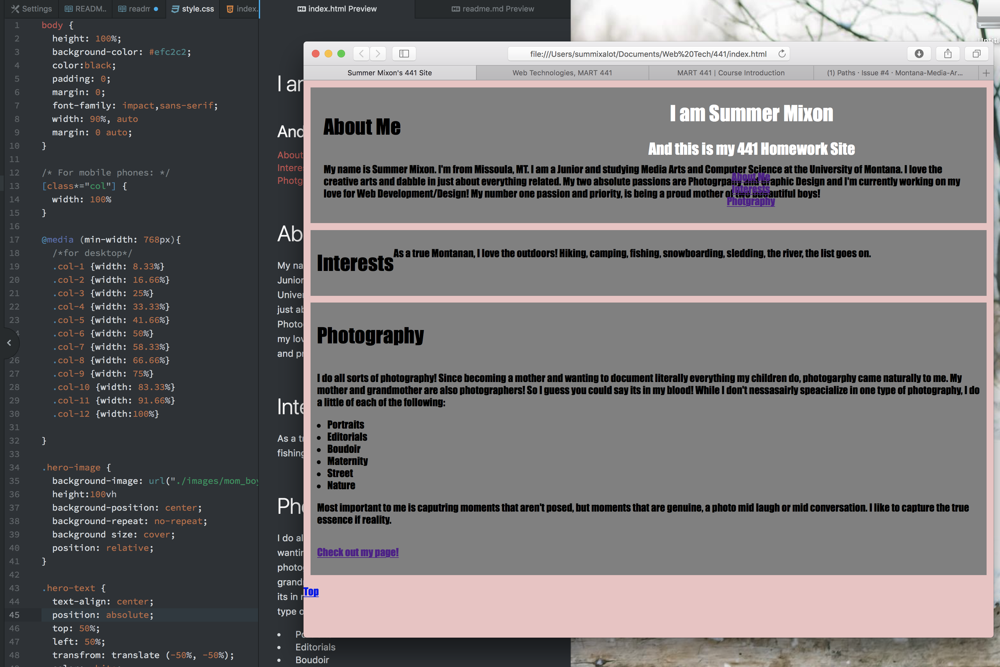
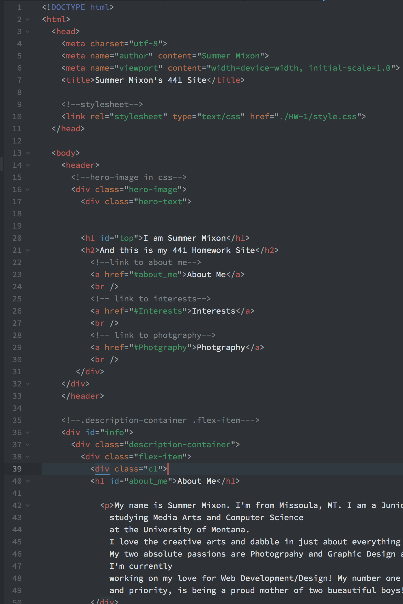

I am very frustrated.
Last semester I didnt learn too much from the class. It was very unorganzied and hard to know exactly what was expected.

Coming into this one isnt without challenges. Now it is full throttle and I cant help but feel like i am behind everyone else.

CSS is what is holding me back.
I need more practice or more resources to learn it better for this class.

I do not want to fail :(

Here is my idea of CSS.

<ul>
<li>THE HERO-IMAGE NOT SHOWING UP IS MY BIGGEST ISSUE. </li>

Well the picture i cant get to pop up in HTML or CSS works in my freaking README. cool. 

