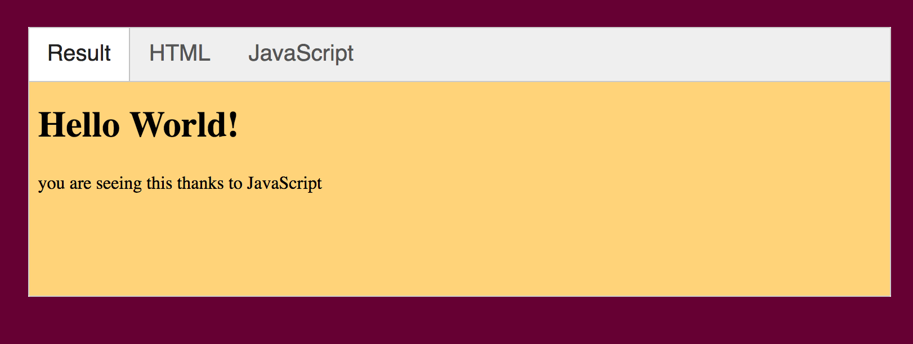
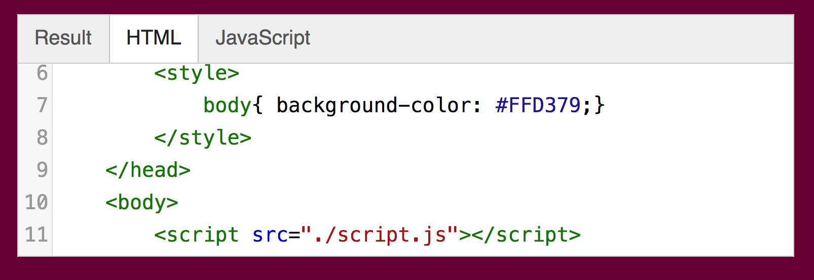
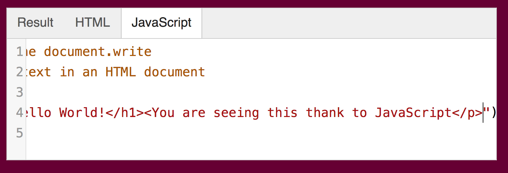

Started by playing around on the practice window provided on the MART441 Website.

 

 Learned about JavaScript via the introduction of the book. It sounds like it
will be challenging. The key here is to make sure the complexity of the codeing
is well written so I don't get confused and so others don't get confused.

JavaScript was made for "begginners",according to the book. There is alot 
room to work and to become more efficient.

I will definetly be practicing on the spaces provided on the homework site,
its better then "guessing and checking" in Atom. I can't find figure out how to
toggle preview on Atom so I can see my work as I go along. I don't know what
happened to it, it was there last time?

